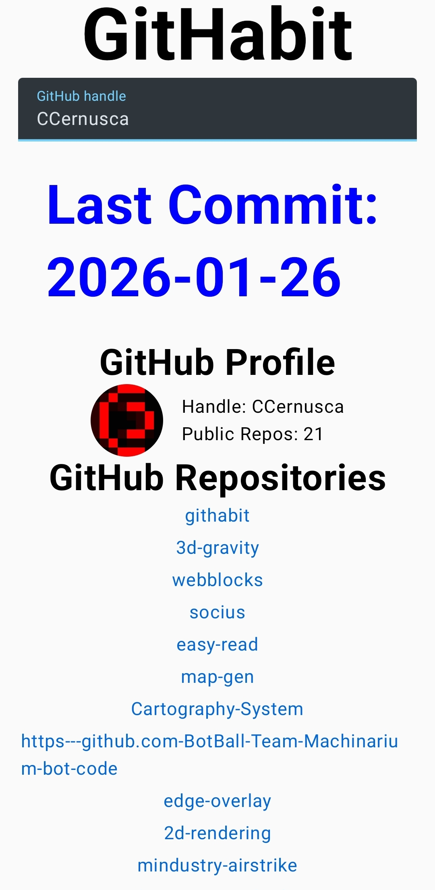

# GitHabit


*This is meant to be an introduction project to Android App Development*

GitHabit is a clean, reactive Android application built with Jetpack Compose that allows users to track their GitHub activity. It provides a real-time overview of a user's profile, repository list, and their most recent commit date.



## Features

Live GitHub Integration: Fetches real-time data from the GitHub REST API using Ktor.

Smart Search: Implements Debouncing to automatically save and fetch data once the user stops typing.

Dynamic UI: Displays user avatars using Coil, public repository lists, and bio information.

Activity Tracking: Highlights the date of the user's last repository update.

Persistent Storage: Saves the user's handle locally using DataStore, ensuring the profile loads instantly on app restart.

Responsive Design: Fully built with a modern, declarative Compose UI including scrollable lists and adaptive layouts.

## Tech Stack

Language: Kotlin

UI Framework: Jetpack Compose

Networking: Ktor Client (OkHttp engine)

Serialization: Kotlinx Serialization

Image Loading: Coil

Local Storage: Jetpack DataStore

## Setup

Clone the repository:

```bash
git clone https://github.com/yourusername/githabit.git
```

Open in Android Studio: Ensure you have the latest version of Arctic Fox or newer.

Add Permissions: Ensure the INTERNET permission is declared in your AndroidManifest.xml.

Run: Build and deploy to an emulator or physical device.

### Or

Only download the APK and install it on your device.

## How to Use

Launch the app and enter a valid GitHub username in the input field.

The app will automatically fetch the profile data after a 500ms delay or upon pressing the "Done" key.

Click on the Avatar or any Repository Name to open the corresponding GitHub page in your browser.
